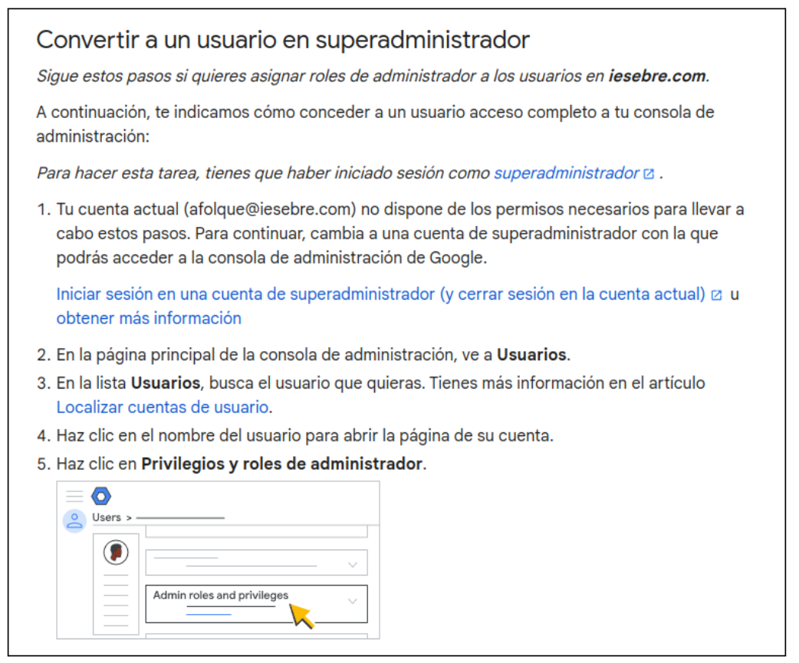

# CAS PRÀCTIC 1

## ÍNDEX

- INTRODUCCIÓ
- PERQUÈ ÉS UNA BONA SOLUCIÓ?
- TIPUS DE CÒPIES DE SEGURETAT
- CÒPIA DE SEGURETAT COMPLETA

- AVANTATGES DE LES CÒPIA DE SEGURETAT COMPLETA
- DESAVANTATGES DE LAS CÒPIA DE SEGURETAT COMPLETA
- CÒPIA DE SEGURETAT INCREMENTAL
- AVANTATGES DE LA CÒPIA DE SEGURETAT INCREMENTAL
- DESAVANTATGES DE LA CÒPIA DE SEGURETAT INCREMENTAL
- CÒPIA DE SEGURETAT DIFERENCIAL
- AVANTATGES DE LA CÒPIA DE SEGURETAT DIFERENCIAL
- DESAVANTATGES DE LA CÒPIA DE SEGURETAT DIFERENCIAL
- COM TENIR MILLOR ÚS DEL NÚVOL
PRESSUPOST
GUIA DE CREACIÓ DE L’USUARI ADMINISTRATIU I USUARI
CREACIÓ D’UNITATS COMPARTIDES BACKUP I DOCUMENTS
INSTAL·LACIÓ D’ADRECES DIRECTES ALS ESCRIPTORIS
BACKUP PER PART DE L’ADMINISTRADOR
CONSULTAR DOCUMENT PER PART DE L’USUARI
COMPROVACIÓ ELIMINACIÓ DOCUMENT
CONCLUSIONS

